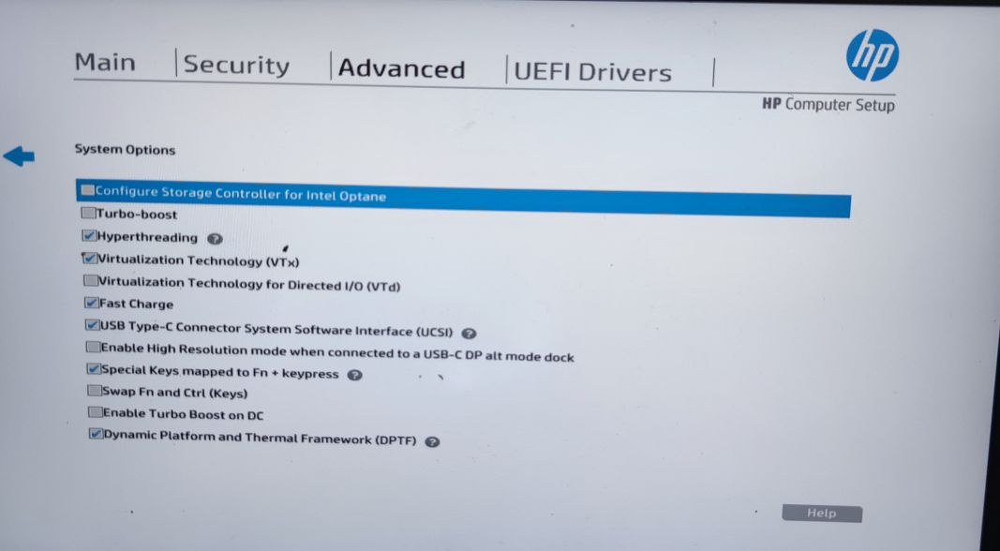

## HP Probook 440 G6 hackintosh 

 支持12 monterey可参考https://github.com/fjh1997/HP_Probook_440_G6_hackintosh/tree/opencore-12 但有hdmi的问题，也可能会无法安装在nvme上
 monterey 12 is this branch https://github.com/fjh1997/HP_Probook_440_G6_hackintosh/tree/opencore-12 .But this branch have hdmi issue.And might not be able to install on nvme.

 支持10.15与10.14。10.14可参考https://github.com/fjh1997/HP_Probook_440_G6_hackintosh/tree/10.14
 support 10.15 and 10.14 . 10.14 is this branch https://github.com/fjh1997/HP_Probook_440_G6_hackintosh/tree/10.14

 bios configuration file is in repo,version is R71 Ver. 01.12.00 07/30/2020
 HpSetup.txt

bios配置文件仓库里有，版本为R71 Ver. 01.12.00 07/30/2020：
 HpSetup.txt

 Be sure to close this in bios,and replace original Micron nvme harddisk to support one，or the nvme ssd is not recognized：
 请确保bios里面关闭这个选项，同时将原装镁光的nvme 硬盘替换为其他支持的牌子，否则nvme不识别。
 

### 电脑配置

| 规格     | 详细信息                                                |
| -------- | ----------------------------------------------------- |
| 电脑型号 | HP Probook 440G6 笔记本电脑                                    |
| 操作系统 | macOS Big Sur 20G165                                   |
| 处理器   | Intel(R) Core(TM) i7-8565U CPU @ 1.80GHz                  |
| 内存     | 8 GB ( Kingston DDR4 2667MHz )                           |
| 硬盘     | WDC WD10SPZX(931 GB)  （原本是镁光的硬盘，不支持）                  |
| 显卡     | 英特尔 UHD Graphics 620 (platform-id:0x‭0900A53E‬)       |
| 显示器   |  LGD  1920x1080 (14 英寸)                      |
| 声卡     | 	Intel Cannon Lake PCH-LP - cAVS  (layout-id:3)                                 |
| 网卡     | Realtek RTL8822BE(更换为  BCM94352Z 支持隔空投送)                     |

### Devices

| Specification     | Detail                                            |
| -------- | ----------------------------------------------------- |
| Model | HP Probook 440G6 Laptop                                    |
| OS | macOS Big Sur 20G165                                  |
| Processor   | Intel(R) Core(TM) i7-8565U CPU @ 1.80GHz                  |
| Memory     | 8 GB ( Kingston DDR4 2667MHz )                           |
| Hard disk     | WDC WD10SPZX(931 GB) （instead of original Micron）                   |
| Graphic card     | Intel UHD Graphics 620 (platform-id:0x0900A53E‬)       |
| Monitor   |  LGD  1920x1080 (14 inch)                      |
| Audio adapter     | 	Intel Cannon Lake PCH-LP - cAVS  (layout-id:3)                                 |
| Network card     | Realtek RTL8822BE( replace to BCM94352Z to support airdrop )                     |

