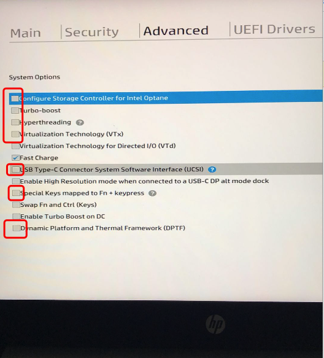

## HP Probook 440 G6 hackintosh 

 支持10.15与10.14。10.14可参考https://github.com/fjh1997/HP_Probook_440_G6_hackintosh/tree/10.14
 support 10.15 and 10.14 . 10.14 is this branch https://github.com/fjh1997/HP_Probook_440_G6_hackintosh/tree/10.14
 Be sure to open this in bios：
 请确保BIOS里打开如下选项：
 

### 电脑配置

| 规格     | 详细信息                                                |
| -------- | ----------------------------------------------------- |
| 电脑型号 | HP Probook 440G6 笔记本电脑                                    |
| 操作系统 | macOS Catalina 19A583                                   |
| 处理器   | Intel(R) Core(TM) i7-8565U CPU @ 1.80GHz                  |
| 内存     | 8 GB ( Kingston DDR4 2667MHz )                           |
| 硬盘     | WDC WD10SPZX(931 GB)                    |
| 显卡     | 英特尔 UHD Graphics 620 (platform-id:0x‭3861980‬)       |
| 显示器   |  LGD  1920x1080 (14 英寸)                      |
| 声卡     | 	Intel Cannon Lake PCH-LP - cAVS  (layout-id:3)                                 |
| 网卡     | Realtek RTL8822BE(不可用)                     |

### Devices

| Specification     | Detail                                            |
| -------- | ----------------------------------------------------- |
| Model | HP Probook 440G6 Laptop                                    |
| OS | macOS Catalina 19A583                                   |
| Processor   | Intel(R) Core(TM) i7-8565U CPU @ 1.80GHz                  |
| Memory     | 8 GB ( Kingston DDR4 2667MHz )                           |
| Hard disk     | WDC WD10SPZX(931 GB)                    |
| Graphic card     | Intel UHD Graphics 620 (platform-id:0x‭3861980‬)       |
| Monitor   |  LGD  1920x1080 (14 inch)                      |
| Audio adapter     | 	Intel Cannon Lake PCH-LP - cAVS  (layout-id:3)                                 |
| Network card     | Realtek RTL8822BE(Not Available)                     |

### 10.14
* 支持休眠
* 不支持Nvme
* 支持sata
* sleep supported
* Nvme unsupported
* sata supported
### 10.15
* 不支持休眠
* 不支持Nvme
* 支持sata
* sleep unsupported
* Nvme unsupported
* sata supported

